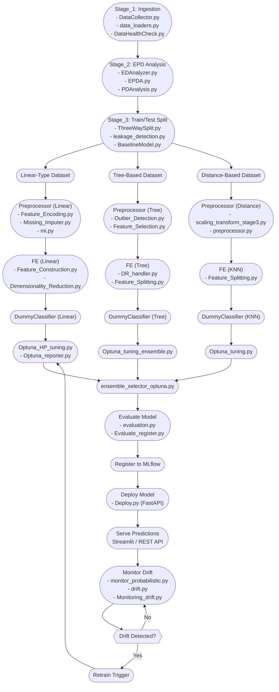

# 🏗️ MLD_LIFECYCLE System Architecture

This document describes the architecture of this ML system — how data flows, what each stage does, and which tools are used for orchestration, versioning, experimentation, monitoring, and deployment. This architecture is **modular**, **reproducible**, and **fully local**, with **no paid SaaS** dependencies.

---

## 🗂️ Project Directory Structure (High-level)

```
MLD_LIFECYCLE/
├── configs/                  # Global config files
├── Data/                     # Local data storage (raw/processed)
├── docs/                     # Documentation and reporting artifacts
├── mlruns/                   # MLflow experiment logs (ignored by DVC)
├── notebooks/                # Jupyter notebooks for prototyping
├── pipeline/                 # ZenML pipeline definitions
├── reports/                  # Validation, drift, explainability reports
├── src/                      # Core pipeline logic (see below)
│   ├── Stage_1_Ingestion/
│   ├── Stage_2_EPD_Analysis/
│   ├── Stage_3_Split_data/
│   ├── Stage_4_Preprocessor/
│   ├── Stage_5_Feature_Engineering/
│   ├── Stage_6_Modelling/
│   ├── Stage_7_Evaluation/
│   ├── Stage_8_HP_tuning/
│   ├── Stage_9_Monitoring/
│   └── Stage_10_Deploy/
├── stacks/                   # ZenML stack setup scripts
├── utils/                    # Common utilities
├── .gitignore, Makefile      # Project control files
├── pyproject.toml, poetry.lock
└── README.md, ARCHITECTURE.md
```

Each `Stage_` folder represents a self-contained ZenML step in your pipeline.

---

## 🧭 Pipeline Stage Overview



## 🧠 Parallelism and Robustness Features

- Preprocessing and Feature Engineering are **parallelized per model type** (linear, tree, distance-based)
- Dummy baseline models help avoid overfitting during Optuna HPO
- Retraining automatically hooks into the HPO process if drift is detected
- All stages are **ZenML steps** with reproducible inputs and tracked lineage

---

## 🧰 Tool Mapping (Per Node)

| Node Label            | Tool/Module                |
| --------------------- | -------------------------- |
| Data Ingestion        | `OmniCollector`            |
| Schema Validation     | Pandera, GE                |
| Cleaning & Imputation | MissingImputer             |
| Preprocessing & FE    | AutoEncoder, Scalers       |
| HPO                   | Optuna + DeepCave          |
| Training, Baseline    | Sklearn / XGBoost + MLflow |
| Evaluation            | MLflow + custom metrics    |
| Explainability        | SHAP, LIME                 |
| Deployment            | FastAPI + Docker           |
| Monitoring            | Evidently, WhyLogs         |

## ✅ Component Responsibilities

| Stage             | Tool(s) Used                    | Key Responsibilities                               |
| ----------------- | ------------------------------- | -------------------------------------------------- |
| **Ingestion**     | OmniCollector                   | Multi-source ingestion (API, JSON, XLS, ZIP, etc.) |
| **Validation**    | Pandera, Great Expectations     | Schema + type enforcement                          |
| **Cleaning**      | MissingImputer                  | Null handling, distribution-aware imputation       |
| **Preprocessing** | AutoCategoricalEncoder, Scalers | Encoding, normalization, bucketing                 |
| **Feature Engg.** | Custom logic                    | Aggregation, lag features, time-encoding           |
| **Tuning**        | Optuna, DeepCave                | Bayesian/grid search, visual comparison            |
| **Training**      | Sklearn / XGBoost + MLflow      | Training + parameter logging                       |
| **Evaluation**    | SHAP, LIME, MLflow              | Interpretability + metrics                         |
| **Monitoring**    | Evidently, WhyLogs              | Data drift, feature changes, concept drift         |
| **Deployment**    | FastAPI, Docker                 | Serving REST endpoint                              |
| **UI**            | Streamlit                       | End-user local interface                           |

---

## 📈 Monitoring & Logging Strategy

| What               | Logged Where?            | Notes                          |
| ------------------ | ------------------------ | ------------------------------ |
| Data schema        | Pandera/GE               | Stored in `reports/`           |
| Experiment runs    | MLflow                   | Tracked per stage              |
| HPO trials         | DeepCave (Optuna `.db`)  | Run `deepcave` locally         |
| Pre/Post drift     | Evidently HTML reports   | Tracked post-evaluation        |
| Feature importance | SHAP, LIME               | Logged with MLflow             |
| Model versions     | MLflow Registry (local)  | Manual promotion to prod stage |
| Prediction logs    | Streamlit or custom logs | Optional export to file        |

---

## 🛠️ CI/CD Flow (Local-First)

- **GitHub Actions** triggers:

  - `pytest`-based test runs for all stages
  - `flake8`/`black` formatting
  - ZenML `pipeline.run()` on merges to `main`
  - Optional artifact building (Docker)

- **Test Tree** ensures:
  - Ingestion schema consistency
  - Pipeline integrity
  - Regression checks on metrics

---

## 🛡️ Governance & Lineage

| Aspect           | Tool Used           |
| ---------------- | ------------------- |
| Audit Reports    | Great Expectations  |
| Metadata Lineage | OpenLineage (local) |
| Data Versioning  | DVC                 |
| Code Lineage     | Git + ZenML DAG     |

> The goal is traceable ML: every input, transformation, and model can be backtracked.

---

## ✅ How to Interpret This Architecture

- **Each stage is testable, replaceable, and loggable.**
- **All outputs (metrics, models, plots) are versioned or referenced.**
- **No cloud dependencies; all dashboards and artifacts are local.**
- **CI/CD ensures reliable reproducibility and automation.**
- **You get production-grade observability with open-source tooling.**

---

## 📌 Related Files

- [`README.md`](./README.md) – quickstart and usage guide
- [`GOALS.md`](./GOALS.md) – motivation and success criteria
- [`TODO/`](./TODO/) – tracking pipeline gaps and enhancements
